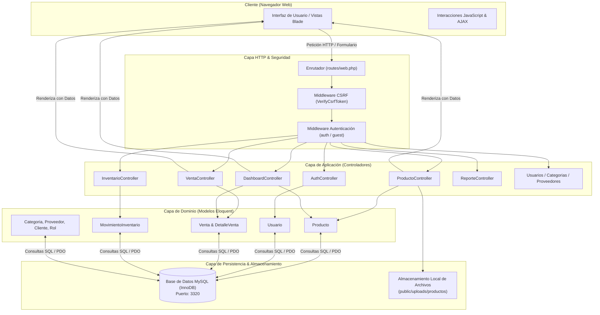
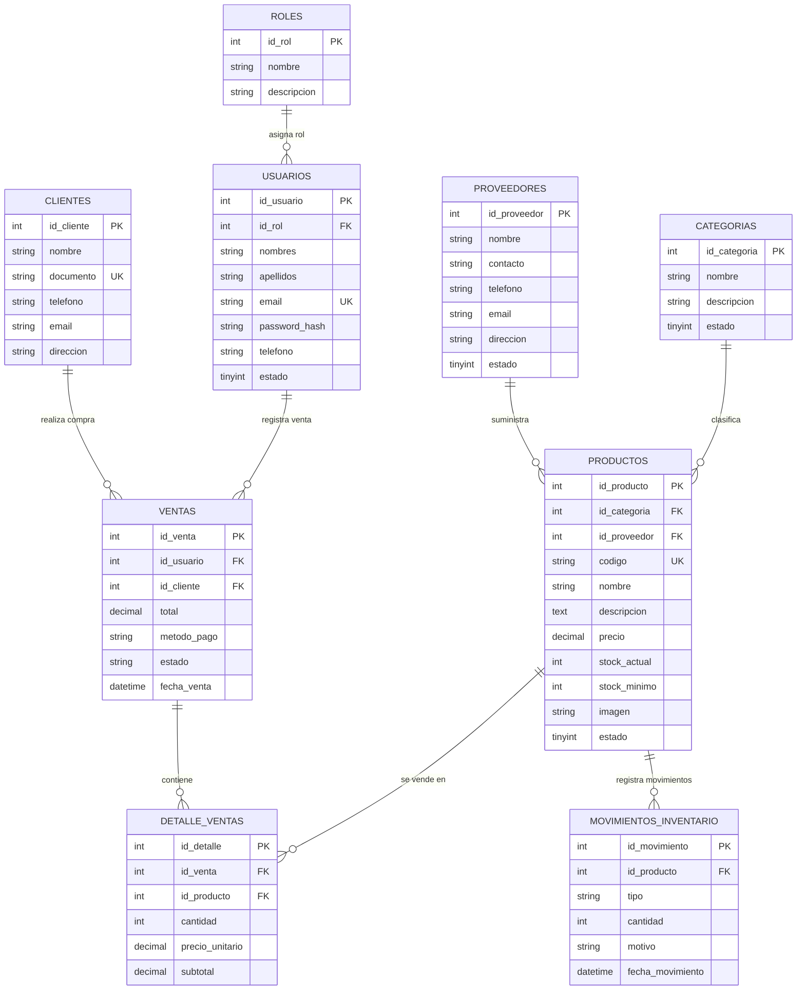
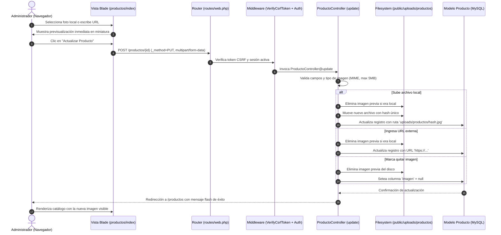

# Arquitectura del Sistema — SuperFresco

**SuperFresco** es una plataforma integral desarrollada en **Laravel** diseñada para la gestión operativa, control de inventario, punto de venta (POS) y catálogo público para un supermercado de productos frescos, gourmet y orgánicos.

---

## 1. Visión General del Sistema

El sistema implementa el patrón arquitectónico clásico y robusto **Modelo - Vista - Controlador (MVC)** complementado por la capa de abstracción de base de datos **Eloquent ORM** y el motor de plantillas **Blade**.



---

## 2. Pila Tecnológica (Tech Stack)

| Capa | Tecnología | Descripción |
| :--- | :--- | :--- |
| **Lenguaje Backend** | **PHP 8.3 (NTS)** | Lenguaje base del servidor. |
| **Framework Backend** | **Laravel Framework (v13.x / base 11+)** | Framework web empresarial con soporte para routing, middleware, Eloquent y sesiones. |
| **Motor de Plantillas** | **Blade Templates** | Motor de vistas precompiladas de Laravel con directivas reactivas y layout modular. |
| **Base de Datos** | **MySQL 8.0 (InnoDB)** | Base de datos relacional con soporte transaccional y claves foráneas, configurada en puerto `3320`. |
| **Estilos & Diseño** | **CSS Moderno / Variables CSS** | Paleta prémium bosque/esmeralda, degradados lineales, sombras suaves y elevación. |
| **Iconografía & Tipografía** | **Google Fonts & FontAwesome 6** | Tipografías `Outfit` (títulos) y `Plus Jakarta Sans` (datos/cuerpo); iconos vectoriales. |
| **Frontend Scripts** | **Vanilla JavaScript (ES6+)** | Lógica de previsualización de imágenes, modales dinámicos, cálculo de ventas y alertas. |
| **Entorno Local** | **Laragon / Artisan Server** | Servidor de desarrollo en `http://127.0.0.1:8000`. |

---

## 3. Modelo de Datos y Entidades (Diagrama Entidad-Relación)

El diseño de la base de datos está normalizado y estructurado para garantizar la integridad referencial en operaciones de inventario y ventas:



---

## 4. Módulos del Sistema

### 4.1. Tienda Pública y Catálogo E-commerce (`/`)
- **Controlador/Ruta**: `routes/web.php` -> `index.blade.php`.
- **Características**:
  - Navbar translúcida con efecto *glassmorphism*.
  - Hero slider promocional de frutas, verduras y productos orgánicos.
  - Catálogo de productos en cuadrícula con badges de estado y stock.
  - Temporizador interactivo de ofertas de temporada.
  - Presentación de beneficios corporativos (envío rápido, calidad garantizada).

### 4.2. Autenticación y Control de Accesos (`/login`, `/register`)
- **Controlador**: `AuthController`.
- **Seguridad**:
  - Encriptación de contraseñas mediante **Bcrypt** con costo 12.
  - Protección contra ataques de fuerza bruta mediante validaciones de formulario.
  - Diferenciación de roles de usuario: **Administrador** (acceso total) y **Empleado** (operaciones de inventario y ventas).

### 4.3. Panel de Control y Analítica (`/dashboard`)
- **Controlador**: `DashboardController`.
- **Funciones**:
  - Métricas KPI (total productos, ventas del día, alertas de stock mínimo y agotado).
  - Gráficos de tendencias y productos más comercializados.
  - Accesos directos a operaciones frecuentes.

### 4.4. Módulo de Productos e Imágenes (`/productos`)
- **Controlador**: `ProductoController`.
- **Modelo**: `Producto.php`.
- **Innovaciones**:
  - **Soporte de Imagen Dual**: Carga de archivo físico (`.jpg`, `.png`, `.webp`) guardado con nombre hash en `public/uploads/productos/` o asignación mediante URL externa.
  - **Accesor Eloquent `imagen_url`**: Normaliza la obtención del recurso independientemente de su origen con fallback a imágenes Unsplash de alta definición.
  - **Previsualización en Tiempo Real**: Vista previa inmediata en JavaScript antes de enviar el formulario.
  - **Limpieza Automática de Archivos**: Eliminación de imágenes obsoletas del disco al actualizar o eliminar un producto.

### 4.5. Monitor de Inventario en Tiempo Real (`/inventario`)
- **Controlador**: `InventarioController`.
- **Funciones**:
  - Registro de entradas, salidas y ajustes de existencias.
  - Indicadores de pulso en vivo para productos en estado óptimo, bajo stock y agotados.

### 4.6. Punto de Venta y Transacciones (`/ventas`)
- **Controlador**: `VentaController`.
- **Funciones**:
  - Creación de recibos con detalle de ítems, cantidades y cálculo dinámico de subtotales e IVA.
  - Integración de clientes y estados de transacción (completada, pendiente, cancelada).

### 4.7. Directorio de Proveedores y Categorías (`/proveedores`, `/categorias`)
- **Controladores**: `ProveedorController`, `CategoriaController`.
- **Funciones**:
  - Catálogo de proveedores con información de contacto y productos suministrados.
  - Gestión taxonómica de productos por familias y departamentos.

### 4.8. Reportes Ejecutivos (`/reportes`)
- **Controlador**: `ReporteController`.
- **Funciones**:
  - Informes mensuales y comparativos de ventas.
  - Alerta de mermas y productos de baja rotación.

---

## 5. Ciclo de Vida de una Petición (Request Lifecycle)

Un ejemplo práctico del flujo de datos cuando un administrador actualiza la imagen de un producto:



---

## 6. Estructura de Directorios del Repositorio

```
inventario_laravel/
├── app/
│   ├── Http/
│   │   └── Controllers/         # Controladores de la aplicación
│   │       ├── AuthController.php
│   │       ├── DashboardController.php
│   │       ├── ProductoController.php
│   │       ├── InventarioController.php
│   │       ├── VentaController.php
│   │       └── ...
│   └── Models/                  # Modelos Eloquent y lógica de negocio
│       ├── Producto.php
│       ├── Usuario.php
│       ├── Venta.php
│       └── ...
├── bootstrap/                   # Inicialización y proveedores de servicios
├── config/                      # Archivos de configuración (app, database, etc.)
├── database/
│   ├── migrations/              # Definiciones del esquema de base de datos
│   └── seeders/                 # Datos iniciales y pruebas
├── docs/                        # Documentación técnica del sistema
│   └── arquitectura.md          # Este documento
├── public/                      # Raíz pública del servidor web
│   ├── index.php                # Punto de entrada HTTP
│   └── uploads/                 # Archivos multimedia subidos
│       └── productos/           # Imágenes locales de los productos
├── resources/
│   └── views/                   # Plantillas Blade del frontend y panel admin
│       ├── auth/                # Vistas de login y registro
│       ├── layouts/             # Plantilla base y barra lateral (sidebar)
│       ├── productos/           # Vistas del catálogo, creación y edición
│       ├── inventario/          # Monitor de stock
│       ├── ventas/              # POS y listado de transacciones
│       └── index.blade.php      # Tienda pública principal
├── routes/
│   └── web.php                  # Definición de rutas y asignación de middlewares
├── storage/                     # Logs, sesiones y cachés del framework
├── .env                         # Variables de entorno y credenciales locales
├── .gitignore                   # Exclusiones de control de versiones Git
└── composer.json                # Dependencias PHP del proyecto
```

---

## 7. Políticas de Seguridad y Confiabilidad

1. **Protección CSRF**: Todas las peticiones mutables (`POST`, `PUT`, `DELETE`) exigen directiva `@csrf` con validación estricta de tokens.
2. **Prevención de Inyección SQL**: Todas las consultas a la base de datos se ejecutan a través del Query Builder de Eloquent con *Prepared Statements* (parámetros vinculados por PDO).
3. **Protección contra XSS**: La sintaxis de Blade `{{ $variable }}` escapa automáticamente los caracteres HTML mediante `htmlspecialchars`.
4. **Protección de Credenciales**: El archivo `.env` se encuentra excluido del repositorio de Git para salvaguardar contraseñas de producción y claves de cifrado.
5. **Aislamiento de Archivos Públicos**: Solo los archivos alojados en `public/` son accesibles directamente por el navegador; el código fuente del núcleo (`app/`, `config/`, `.env`) permanece inaccesible desde peticiones externas.
