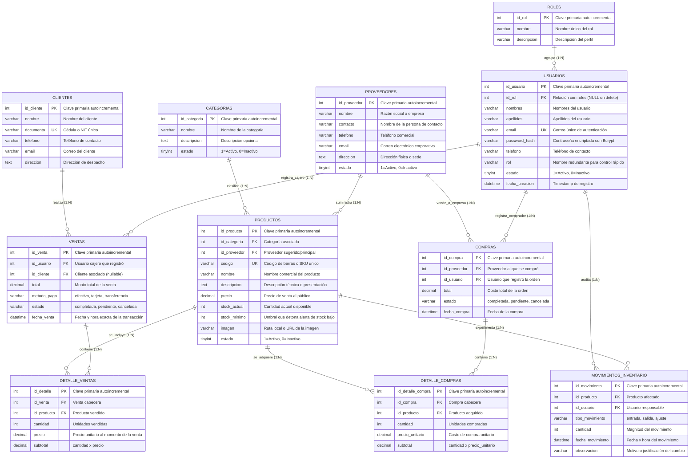

# Diccionario de Datos y Modelo Relacional — SuperFresco

Este documento describe detalladamente la estructura de la base de datos relacional MySQL (**`bdsupermercado_dev`**), sus 11 tablas, claves primarias, claves foráneas, tipos de datos, restricciones y reglas de negocio.

---

## 1. Diagrama Entidad - Relación (Mermaid ERD)

---

## 2. Diccionario Detallado de Tablas

### 2.1 Tabla `roles`
Almacena los perfiles de autorización del sistema.

| Campo | Tipo | Nulo | Clave | Default | Descripción |
| :--- | :--- | :---: | :---: | :---: | :--- |
| `id_rol` | `INT UNSIGNED` | NO | **PK** | *Auto_inc* | Identificador único del rol. |
| `nombre` | `VARCHAR(100)` | NO | — | — | Nombre único: `administrador`, `empleado`, `cliente`. |
| `descripcion`| `VARCHAR(255)` | SÍ | — | `NULL` | Explicación del nivel de acceso. |

---

### 2.2 Tabla `usuarios`
Cuentas de acceso para administradores, empleados y clientes.

| Campo | Tipo | Nulo | Clave | Default | Descripción |
| :--- | :--- | :---: | :---: | :---: | :--- |
| `id_usuario` | `INT UNSIGNED` | NO | **PK** | *Auto_inc* | Identificador del usuario. |
| `id_rol` | `INT UNSIGNED` | SÍ | **FK** | `NULL` | Referencia a `roles(id_rol)` con `ON DELETE SET NULL`. |
| `nombres` | `VARCHAR(100)` | NO | — | — | Nombres del titular. |
| `apellidos` | `VARCHAR(100)` | NO | — | `''` | Apellidos del titular. |
| `email` | `VARCHAR(150)` | NO | **UK** | — | Correo electrónico único de acceso. |
| `password_hash`| `VARCHAR(255)` | NO | — | — | Contraseña protegida con Hash Bcrypt. |
| `telefono` | `VARCHAR(30)` | SÍ | — | `NULL` | Línea de contacto. |
| `rol` | `VARCHAR(50)` | NO | — | `'cliente'` | String de rol para validaciones rápidas (`administrador`, `empleado`, `cliente`). |
| `estado` | `TINYINT(1)` | NO | — | `1` | `1` = Activo, `0` = Inactivo / Bloqueado. |
| `fecha_creacion`| `DATETIME` | NO | — | `CURRENT_TIMESTAMP` | Fecha de registro en la plataforma. |

---

### 2.3 Tabla `categorias`
Clasificación de productos en familias de abarrotes y perecederos.

| Campo | Tipo | Nulo | Clave | Default | Descripción |
| :--- | :--- | :---: | :---: | :---: | :--- |
| `id_categoria`| `INT UNSIGNED` | NO | **PK** | *Auto_inc* | Identificador de la categoría. |
| `nombre` | `VARCHAR(100)` | NO | — | — | Nombre descriptivo de la categoría. |
| `descripcion` | `VARCHAR(255)` | SÍ | — | `NULL` | Detalle de los artículos que engloba. |
| `estado` | `TINYINT(1)` | NO | — | `1` | `1` = Activo, `0` = Inactivo. |

---

### 2.4 Tabla `proveedores`
Empresas y distribuidoras comerciales.

| Campo | Tipo | Nulo | Clave | Default | Descripción |
| :--- | :--- | :---: | :---: | :---: | :--- |
| `id_proveedor`| `INT UNSIGNED` | NO | **PK** | *Auto_inc* | Identificador del proveedor. |
| `nombre` | `VARCHAR(150)` | NO | — | — | Razón social o nombre comercial. |
| `contacto` | `VARCHAR(100)` | SÍ | — | `NULL` | Persona de contacto o asesor comercial. |
| `telefono` | `VARCHAR(30)` | SÍ | — | `NULL` | Línea telefónica directa. |
| `email` | `VARCHAR(150)` | SÍ | — | `NULL` | Correo de pedidos y cotizaciones. |
| `direccion` | `VARCHAR(255)` | SÍ | — | `NULL` | Dirección de despacho o bodegas. |
| `estado` | `TINYINT(1)` | NO | — | `1` | `1` = Activo, `0` = Inactivo. |

---

### 2.5 Tabla `productos`
Artículos del inventario y del catálogo público.

| Campo | Tipo | Nulo | Clave | Default | Descripción |
| :--- | :--- | :---: | :---: | :---: | :--- |
| `id_producto` | `INT UNSIGNED` | NO | **PK** | *Auto_inc* | Identificador del producto. |
| `id_categoria`| `INT UNSIGNED` | SÍ | **FK** | `NULL` | Referencia a `categorias(id_categoria)`. |
| `id_proveedor`| `INT UNSIGNED` | SÍ | **FK** | `NULL` | Referencia a `proveedores(id_proveedor)`. |
| `codigo` | `VARCHAR(50)` | NO | **UK** | — | Código de barras o SKU único. |
| `nombre` | `VARCHAR(150)` | NO | — | — | Nombre comercial del producto. |
| `descripcion` | `TEXT` | SÍ | — | `NULL` | Especificaciones o presentación comercial. |
| `precio` | `DECIMAL(10,2)`| NO | — | `0.00` | Precio unitario al público en pesos. |
| `stock_actual`| `INT` | NO | — | `0` | Existencias actuales en góndola/bodega. |
| `stock_minimo`| `INT` | NO | — | `5` | Umbral para disparar la alerta de stock bajo. |
| `imagen` | `VARCHAR(255)` | SÍ | — | `NULL` | Ruta de subida (`uploads/productos/...`) o URL. |
| `estado` | `TINYINT(1)` | NO | — | `1` | `1` = Activo para venta, `0` = Inactivo. |

---

### 2.6 Tabla `clientes`
Registro de compradores frecuentes o clientes con factura nominal.

| Campo | Tipo | Nulo | Clave | Default | Descripción |
| :--- | :--- | :---: | :---: | :---: | :--- |
| `id_cliente` | `INT UNSIGNED` | NO | **PK** | *Auto_inc* | Identificador del cliente. |
| `nombre` | `VARCHAR(150)` | NO | — | — | Nombre completo o razón social. |
| `documento` | `VARCHAR(30)` | SÍ | **UK** | `NULL` | Cédula de ciudadanía o NIT. |
| `telefono` | `VARCHAR(30)` | SÍ | — | `NULL` | Teléfono de contacto. |
| `email` | `VARCHAR(150)` | SÍ | — | `NULL` | Correo electrónico para facturación. |
| `direccion` | `VARCHAR(255)` | SÍ | — | `NULL` | Dirección de envío o residencia. |

---

### 2.7 Tabla `ventas`
Encabezado de las transacciones del punto de venta (POS).

| Campo | Tipo | Nulo | Clave | Default | Descripción |
| :--- | :--- | :---: | :---: | :---: | :--- |
| `id_venta` | `INT UNSIGNED` | NO | **PK** | *Auto_inc* | Número único de recibo/venta. |
| `id_usuario` | `INT UNSIGNED` | SÍ | **FK** | `NULL` | Cajero o usuario que emitió la venta. |
| `id_cliente` | `INT UNSIGNED` | SÍ | **FK** | `NULL` | Cliente comprador (`NULL` = Público general). |
| `total` | `DECIMAL(10,2)`| NO | — | `0.00` | Suma de subtotales de la venta. |
| `metodo_pago`| `VARCHAR(50)` | NO | — | `'efectivo'` | `efectivo`, `tarjeta`, `transferencia`. |
| `estado` | `VARCHAR(50)` | NO | — | `'completada'`| `completada`, `pendiente`, `cancelada`. |
| `fecha_venta`| `DATETIME` | NO | — | `CURRENT_TIMESTAMP` | Fecha y hora exacta de emisión. |

---

### 2.8 Tabla `detalle_ventas`
Renglones de ítems vendidos por cada recibo.

| Campo | Tipo | Nulo | Clave | Default | Descripción |
| :--- | :--- | :---: | :---: | :---: | :--- |
| `id_detalle` | `INT UNSIGNED` | NO | **PK** | *Auto_inc* | Identificador de línea. |
| `id_venta` | `INT UNSIGNED` | NO | **FK** | — | Venta cabecera (`CASCADE` on delete). |
| `id_producto`| `INT UNSIGNED` | NO | **FK** | — | Producto vendido. |
| `cantidad` | `INT` | NO | — | `1` | Unidades despachadas. |
| `precio` | `DECIMAL(10,2)`| NO | — | `0.00` | Precio unitario congelado al vender. |
| `subtotal` | `DECIMAL(10,2)`| NO | — | `0.00` | `cantidad * precio`. |

---

### 2.9 Tabla `movimientos_inventario`
Pista de auditoría completa de entradas, salidas y mermas de existencias.

| Campo | Tipo | Nulo | Clave | Default | Descripción |
| :--- | :--- | :---: | :---: | :---: | :--- |
| `id_movimiento`| `INT UNSIGNED` | NO | **PK** | *Auto_inc* | Identificador del evento de auditoría. |
| `id_producto` | `INT UNSIGNED` | NO | **FK** | — | Producto cuyo stock cambió. |
| `id_usuario` | `INT UNSIGNED` | SÍ | **FK** | `NULL` | Usuario responsable del movimiento. |
| `tipo_movimiento`| `VARCHAR(20)`| NO | — | — | `entrada`, `salida`, `ajuste`. |
| `cantidad` | `INT` | NO | — | — | Magnitud del cambio en unidades. |
| `fecha_movimiento`| `DATETIME`| NO | — | `CURRENT_TIMESTAMP` | Momento exacto de la modificación. |
| `observacion` | `VARCHAR(255)`| SÍ | — | `NULL` | Causa (ej. "Venta #12", "Merma por vencimiento"). |

---

### 2.10 Tabla `compras` y 2.11 Tabla `detalle_compras`
Gestión de aprovisionamiento de stock con proveedores externos:
* `compras`: Cabecera con `id_proveedor`, `id_usuario`, `total`, `estado` y `fecha_compra`.
* `detalle_compras`: Líneas de orden con `id_producto`, `cantidad`, `precio_unitario` y `subtotal`.

---

## 3. Reglas de Integridad y Transacciones

1. **Descuento de Stock Transaccional:** Cada registro en `ventas` se realiza bajo una transacción de base de datos (`DB::beginTransaction()`). Si falla el cálculo o el stock es insuficiente, se aplica un `DB::rollBack()` automático para evitar inconsistencias.
2. **Registro de Auditoría Concurrente:** Toda venta genera automáticamente un registro correlativo en `movimientos_inventario` con tipo `salida`.
3. **Cálculo de Alertas:** Un producto detona alerta en el sistema si y solo si:
   $$\text{stock\_actual} \le \text{stock\_minimo} \quad \text{y} \quad \text{estado} = 1$$
