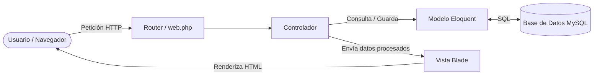
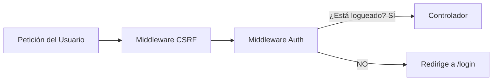

# Guía de Conceptos Fundamentales de Laravel — SuperFresco

Este documento explica de forma didáctica, técnica y práctica los conceptos centrales del framework **Laravel** implementados en el proyecto **SuperFresco**. Cada sección incluye explicaciones claras y ejemplos con el código real del proyecto.

---

## Índice

1. [El Patrón Arquitectónico MVC](#1-el-patrón-arquitectónico-mvc)
2. [Ciclo de Vida de una Petición (Request Lifecycle)](#2-ciclo-de-vida-de-una-petición-request-lifecycle)
3. [Enrutamiento (Routing)](#3-enrutamiento-routing)
4. [Middlewares (Filtros HTTP)](#4-middlewares-filtros-http)
5. [Controladores (Controllers)](#5-controladores-controllers)
6. [Modelos y Eloquent ORM](#6-modelos-y-eloquent-orm)
7. [Motor de Plantillas Blade](#7-motor-de-plantillas-blade)
8. [Migraciones y Esquema de Base de Datos](#8-migraciones-y-esquema-de-base-de-datos)
9. [Autenticación, Sesiones y Seguridad](#9-autenticación-sesiones-y-seguridad)
10. [Gestión de Carga de Archivos (File Uploads)](#10-gestión-de-carga-de-archivos-file-uploads)
11. [Variables de Entorno y Configuración (.env)](#11-variables-de-entorno-y-configuración-env)

---

## 1. El Patrón Arquitectónico MVC

Laravel estructura las aplicaciones utilizando el patrón **Modelo - Vista - Controlador (MVC)**:

- **Modelo (Model)**: Representa los datos y la lógica de negocio. Interactúa con la base de datos mediante Eloquent ORM. *(Ubicación: `app/Models/`)*.
- **Vista (View)**: La interfaz visual que ve el usuario final. En Laravel se construyen con plantillas Blade. *(Ubicación: `resources/views/`)*.
- **Controlador (Controller)**: Actúa como el intermediario. Recibe la petición del usuario, consulta o actualiza los Modelos, y envía los datos necesarios a la Vista. *(Ubicación: `app/Http/Controllers/`)*.



---

## 2. Ciclo de Vida de una Petición (Request Lifecycle)

Cada vez que un usuario interactúa con la aplicación en `http://127.0.0.1:8000`:

1. **Punto de Entrada (`public/index.php`)**: Toda solicitud entra por este archivo único.
2. **Carga del Autoloader y Bootstrap (`bootstrap/app.php`)**: Registra las dependencias de Composer y enciende las instancias del framework.
3. **HTTP Kernel & Middlewares**: Valida cookies de sesión, comprueba tokens CSRF y verifica autenticación.
4. **Enrutamiento (`routes/web.php`)**: Determina qué controlador y método debe procesar la URL.
5. **Controlador**: Ejecuta la lógica y retorna una respuesta (HTML, JSON o Redirección).
6. **Respuesta al Cliente**: El navegador recibe el HTML resultante con código de estado HTTP (`200 OK`, `302 Redirect`, etc.).

---

## 3. Enrutamiento (Routing)

Las rutas se definen en el archivo `routes/web.php`. Mapean URLs a funciones anónimas o a métodos de un controlador.

### Métodos HTTP Disponibles
- `Route::get($uri, $callback)`: Obtener y mostrar datos (ej. cargar una página).
- `Route::post($uri, $callback)`: Enviar y guardar datos nuevos (ej. crear producto).
- `Route::put($uri, $callback)`: Actualizar un registro completo existente.
- `Route::delete($uri, $callback)`: Eliminar un registro.

### Rutas con Recursos (`Route::resource`)
Crea automáticamente las 7 rutas RESTful estándar (`index`, `create`, `store`, `show`, `edit`, `update`, `destroy`):

```php
// Ejemplo en routes/web.php
Route::resource('productos', ProductoController::class)->except(['show']);
```

### Rutas Nombradas (Named Routes)
Asignar un nombre a una ruta permite enlazarla fácilmente en las vistas sin depender de URLs fijas:

```php
Route::get('/login', [AuthController::class, 'showLogin'])->name('login');
```
*En Blade se invoca con:* `route('login')` ➔ Genera automáticamente `http://127.0.0.1:8000/login`.

---

## 4. Middlewares (Filtros HTTP)

Los middlewares actúan como **capas de seguridad o filtros** que inspeccionan la petición antes de que llegue al controlador:



### Middlewares Usados en el Proyecto:

1. **`guest`**: Solo permite acceso a usuarios **no autenticados**. Si ya iniciaste sesión y entras a `/login`, te redirige al `/dashboard`.
   ```php
   Route::middleware('guest')->group(function () {
       Route::get('/login', [AuthController::class, 'showLogin'])->name('login');
   });
   ```
2. **`auth`**: Exige que el usuario haya iniciado sesión obligatoriamente. Si no tiene sesión activa, lo expulsa a `/login`.
   ```php
   Route::middleware('auth')->group(function () {
       Route::get('/dashboard', [DashboardController::class, 'index'])->name('dashboard');
       Route::resource('productos', ProductoController::class);
   });
   ```

---

## 5. Controladores (Controllers)

Un controlador agrupa la lógica de manejo de peticiones para una entidad específica.

### Inyección de Dependencias y Validación de Formularios
Laravel permite inyectar automáticamente la clase `Request` para acceder a los datos enviados por el usuario:

```php
// Ejemplo de app/Http/Controllers/ProductoController.php
public function store(Request $r)
{
    // Validación automática: Si falla, Laravel regresa con los errores
    $r->validate([
        'nombre'         => 'required|string|max:150',
        'codigo'         => 'required|string|max:50|unique:productos,codigo',
        'precio'         => 'required|numeric|min:0',
        'imagen_archivo' => 'nullable|image|mimes:jpeg,png,jpg,webp|max:5120',
    ]);

    // Crear registro
    Producto::create($data);

    // Redirección con mensaje flash en sesión
    return redirect()->route('productos.index')
        ->with('success', 'Producto creado correctamente.');
}
```

> [!TIP]
> Los mensajes enviados con `with('success', '...')` son datos "flash" que solo viven durante la siguiente petición HTTP y se borran automáticamente tras mostrarse en pantalla.

---

## 6. Modelos y Eloquent ORM

**Eloquent** es el mapeador objeto-relacional (ORM) de Laravel. Cada tabla de la base de datos se representa con una clase PHP (Modelo). En lugar de escribir sentencias SQL manuales como `SELECT * FROM productos`, se utiliza código orientado a objetos.

### Configuración del Modelo (`app/Models/Producto.php`)

```php
namespace App\Models;
use Illuminate\Database\Eloquent\Model;

class Producto extends Model {
    protected $table = 'productos';              // Tabla asociada en MySQL
    protected $primaryKey = 'id_producto';        // Llave primaria personalizada
    public $timestamps = false;                  // Desactiva created_at y updated_at automáticos
    
    // Campos permitidos para inserción masiva (Mass Assignment)
    protected $fillable = [
        'id_categoria', 'id_proveedor', 'codigo', 'nombre',
        'descripcion', 'precio', 'stock_actual', 'stock_minimo',
        'imagen', 'estado'
    ];
}
```

### Relaciones entre Modelos

1. **`belongsTo` (Muchos a Uno)**:
   Un producto pertenece a una categoría y a un proveedor:
   ```php
   public function categoria() {
       return $this->belongsTo(Categoria::class, 'id_categoria', 'id_categoria');
   }
   ```
   *Uso:* `$producto->categoria->nombre`

2. **`hasMany` (Uno a Muchos)**:
   Un producto puede tener muchos detalles de ventas:
   ```php
   public function detalleVentas() {
       return $this->hasMany(DetalleVenta::class, 'id_producto', 'id_producto');
   }
   ```

### Accesores (Accessors)
Permiten transformar o formatear el valor de un atributo cuando se lee del modelo:

```php
// Accesor para imagen_url en Producto.php
public function getImagenUrlAttribute()
{
    if (empty($this->imagen)) {
        return 'https://images.unsplash.com/photo-1542838132-92c53300491e?w=400&q=70';
    }

    if (str_starts_with($this->imagen, 'http://') || str_starts_with($this->imagen, 'https://')) {
        return $this->imagen;
    }

    return asset($this->imagen);
}
```
*En cualquier vista o controlador:* `$producto->imagen_url` devuelve automáticamente la URL completa y funcional.

### Eager Loading (Carga Ansiosa con `with`)
Previene el problema de rendimiento **N+1** en bases de datos cargando las relaciones en una sola consulta optimizada:

```php
// En lugar de hacer una consulta SQL por cada producto:
$productos = Producto::with(['categoria', 'proveedor'])->paginate(12);
```

---

## 7. Motor de Plantillas Blade

Blade es el motor de vistas de Laravel. Los archivos terminan en `.blade.php`.

### Herencia de Plantillas (Layouts)
Permite reutilizar estructuras HTML completas (barra de navegación, sidebar, estilos, footer) sin duplicar código:

```blade
{{-- layouts/sidebar.blade.php define la estructura maestra --}}
<!DOCTYPE html>
<html>
<head>
    <title>@yield('title', 'SuperFresco')</title>
    @stack('styles')
</head>
<body>
    <aside class="sidebar"> ... </aside>
    <main class="main-content">
        @yield('content')
    </main>
    @stack('scripts')
</body>
</html>
```

*Una vista hija (como `productos/index.blade.php`) solo extiende el layout:*
```blade
@extends('layouts.sidebar')

@section('title', 'Catálogo de Productos')

@section('content')
    <h1>Gestión de Productos</h1>
    {{-- Contenido específico aquí --}}
@endsection
```

### Directivas Principales de Blade

| Directiva | Propósito | Ejemplo |
| :--- | :--- | :--- |
| `{{ $variable }}` | Imprime texto **escapando HTML** (Protección contra XSS). | `{{ $p->nombre }}` |
| `@csrf` | Inserta un token oculto para evitar ataques de falsificación de peticiones. | `<form> @csrf ... </form>` |
| `@method('PUT')` | Simula métodos HTTP `PUT`, `PATCH` o `DELETE` en formularios HTML. | `<form> @method('PUT') ... </form>` |
| `@if / @endif` | Estructuras condicionales. | `@if($p->stock_actual == 0) Agotado @endif` |
| `@foreach` | Iteración sobre colecciones de Eloquent. | `@foreach($productos as $p) ... @endforeach` |
| `@error('campo')` | Muestra mensajes de error de validación de formulario. | `@error('precio') <small>{{ $message }}</small> @enderror` |

---

## 8. Migraciones y Esquema de Base de Datos

Las migraciones son el **control de versiones** de tu base de datos. Permiten definir y modificar tablas mediante código PHP reproducible:

```php
// database/migrations/2025_01_01_000005_create_productos_table.php
Schema::create('productos', function (Blueprint $table) {
    $table->integer('id_producto')->autoIncrement();
    $table->integer('id_categoria')->nullable();
    $table->string('codigo', 50)->unique();
    $table->string('nombre', 150);
    $table->decimal('precio', 10, 2)->default(0.00);
    $table->integer('stock_actual')->default(0);
    $table->string('imagen')->nullable();
    $table->tinyInteger('estado')->default(1);
    
    // Llaves foráneas
    $table->foreign('id_categoria')->references('id_categoria')->on('categorias');
});
```

---

## 9. Autenticación, Sesiones y Seguridad

Laravel cuenta con un sistema integrado y seguro para gestionar usuarios y sesiones:

```mermaid
flowchart TD
    Login[Usuario envía email y password] --> Find[Busca usuario por email en DB]
    Find --> HashCheck{Hash::check(password, password_hash)}
    HashCheck -->|Coincide| Session[Auth::login(usuario) + Regenera ID de Sesión]
    Session --> Dashboard[Redirige a /dashboard]
    HashCheck -->|No coincide| Error[Retorna con error de credenciales]
```

### Hasheo Seguro de Contraseñas (Bcrypt)
Las contraseñas **nunca** se guardan en texto plano en la base de datos:
- Para verificar al autenticar: `Hash::check($passwordPlano, $usuario->password_hash)`
- Para registrar un nuevo usuario: `Hash::make($password)`

### Protección CSRF
Todos los formularios que envían datos (`POST`, `PUT`, `DELETE`) incluyen la directiva `@csrf`. Laravel genera un token único por sesión que valida que la petición proviene genuinamente de tu aplicación y no de un sitio malicioso externo.

---

## 10. Gestión de Carga de Archivos (File Uploads)

Para recibir archivos desde un formulario web:

1. El formulario **debe** tener el atributo `enctype="multipart/form-data"`.
2. En el controlador se valida que sea una imagen válida:
   ```php
   $r->validate([
       'imagen_archivo' => 'nullable|image|mimes:jpeg,png,jpg,webp|max:5120'
   ]);
   ```
3. Se genera un nombre único y se almacena en la carpeta pública:
   ```php
   if ($r->hasFile('imagen_archivo') && $r->file('imagen_archivo')->isValid()) {
       $file = $r->file('imagen_archivo');
       $nombreUnico = 'prod_' . uniqid() . '.' . $file->getClientOriginalExtension();
       $file->move(public_path('uploads/productos'), $nombreUnico);
       $data['imagen'] = 'uploads/productos/' . $nombreUnico;
   }
   ```
4. Se elimina el archivo físico previo al actualizar o borrar para evitar archivos huérfanos:
   ```php
   if ($producto->imagen && file_exists(public_path($producto->imagen))) {
       @unlink(public_path($producto->imagen));
   }
   ```

---

## 11. Variables de Entorno y Configuración (.env)

El archivo `.env` almacena variables sensibles y configuraciones específicas del entorno local de cada máquina:

```ini
APP_NAME=SuperFresco
APP_ENV=local
APP_DEBUG=true
APP_URL=http://localhost:8000

DB_CONNECTION=mysql
DB_HOST=127.0.0.1
DB_PORT=3320
DB_DATABASE=bdsupermercado_dev
DB_USERNAME=root
DB_PASSWORD=
```

> [!IMPORTANT]
> El archivo `.env` está en el `.gitignore` y **nunca debe subirse a repositorios públicos de GitHub**. Para compartir la estructura con otros desarrolladores, se utiliza `.env.example` con las claves vacías.

---

## Resumen de Comandos Artisan Más Usados

| Comando | Función |
| :--- | :--- |
| `php artisan serve` | Enciende el servidor local de desarrollo (`http://127.0.0.1:8000`). |
| `php artisan route:list` | Muestra la lista completa de rutas registradas en el sistema. |
| `php artisan migrate` | Ejecuta las migraciones pendientes en la base de datos MySQL. |
| `php artisan tinker` | Abre una consola interactiva para probar código PHP y consultas Eloquent. |
| `php artisan optimize:clear` | Limpia todas las cachés de configuración, rutas y vistas Blade. |
